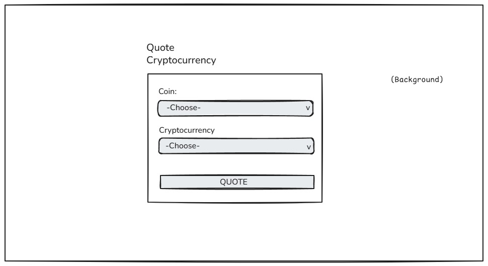
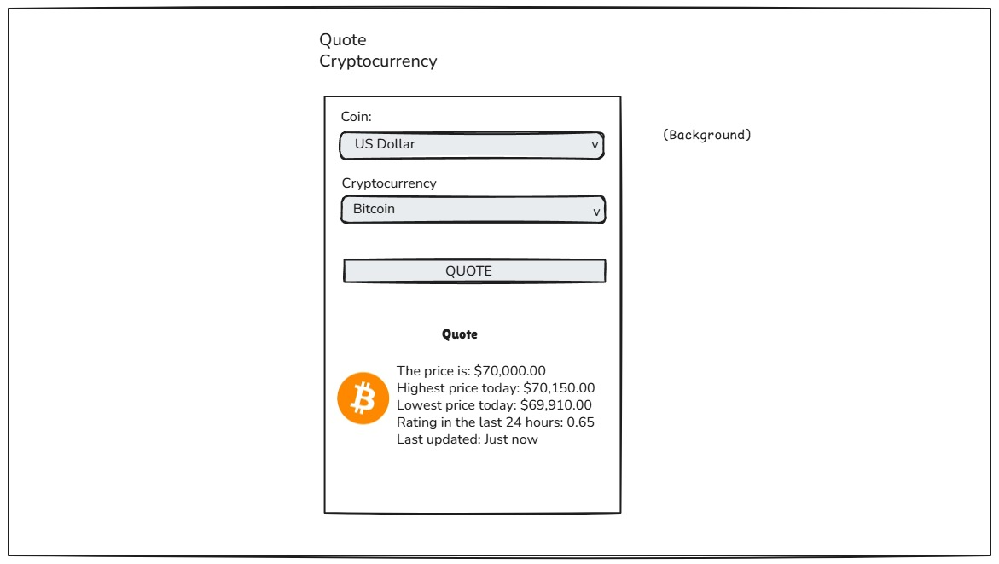

# Cryptocurrency-Quotes: Overview

Class CSE499: Senior Project from BYU-Idaho.

Team Members: 

 🤵 Cherry Wilmer Machado Carreno.
 ◾ My Quote: "Be strong and of a good courage" Joshua 1:6.

 🤵 Bitner Gordon Torres.
 
 🤵 Racheal Katono.

Our Project Proposal: A Minimalist, REST-Driven Hub for cryptocurrency-quotes.

As our Senior Project, we are proposing to build a high-performance web application designed to solve the problem of information fatigue. By leveraging the CoinDesk Data API — widely recognized as an institutional-grade authority for market pricing — We will develop a streamlined, RESTful dashboard that serves as a single source of truth for the most common digital assets.

We intend to focus on a 'Minimalist-First' architecture. Instead of building just another exchange, We will create a professional-grade interface that fetches and displays live 'Cryptocurrency Quotes' with surgical precision.

# Sprint 1: API Research & Integration (Lead: Racheal Katono) 

# 1. Documentation Analysis Verified the CoinDesk BPI (Bitcoin Price Index) as our primary data source for institutional-grade market pricing. Mapped the current API endpoints to ensure seamless data flow into the React frontend. Analyzed rate limits and documentation to ensure the application remains within "reasonable use" parameters. 

# 2. Supported Symbols & Assets Confirmed primary support for Bitcoin (BTC) as the base asset. Documented supported fiat currency codes: USD, EUR, and GBP. 

# 3. Technical Prototype Developed a functional fetch request prototype to verify real-time connectivity to the CoinDesk API. Validated the response structure to prepare for Zod type definitions and state management integration. 

# 4. Current Blockers Investigating a secondary API source to fetch real-time coin logos, as the current CoinDesk endpoint provides numerical price data only. 

[Expense and Budget Control System Deployment]()

[Expense and Budget Control System Demo Video]()

# Color Pallete
  -  white: #FFF;
  -  primary: #61ECBC;
  -  black: #182339;
  -  Form Background #ECEBEB;

# Color Pallete for "Signal over Noise" 
  - white: #FFFFFF;
  - primary: #3B82F6;          # clean, modern blue
  - secondary: #60A5FA;        # lighter supporting blue
  - accent: #93C5FD;           # soft highlight blue
  - black: #0F172A;            # deep navy for text
  - text-secondary: #475569;   # muted text
  - border: #E2E8F0;           # subtle separators
  - background: #F8FAFC;       # fallback / base layer
  - Form Background: #EFF6FF;  # soft blue-tinted panels

# Wireframe

# Development Environment

✅ Visual Studio Code
✅ React
✅ TypeScript
✅ Tailwinds CSS
✅ Zod
✅ Zustand

# Useful Websites

* [Visual Studio Code](https://code.visualstudio.com/)
* [React](https://reactjs.org/)
* [TypeScript](https://www.typescriptlang.org/)
* [Tailwinds CSS](https://tailwindcss.com/)
* [Zod](https://zod.dev/)
* [Zustand](https://zustand.docs.pmnd.rs/learn/getting-started/introduction)
